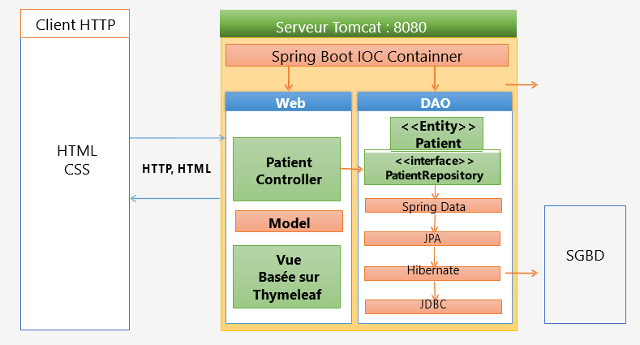
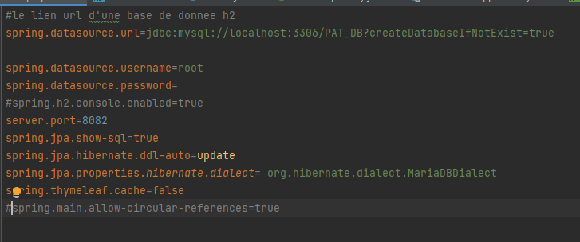
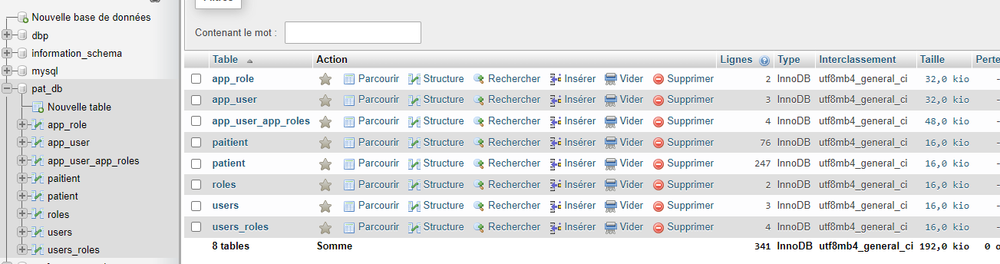
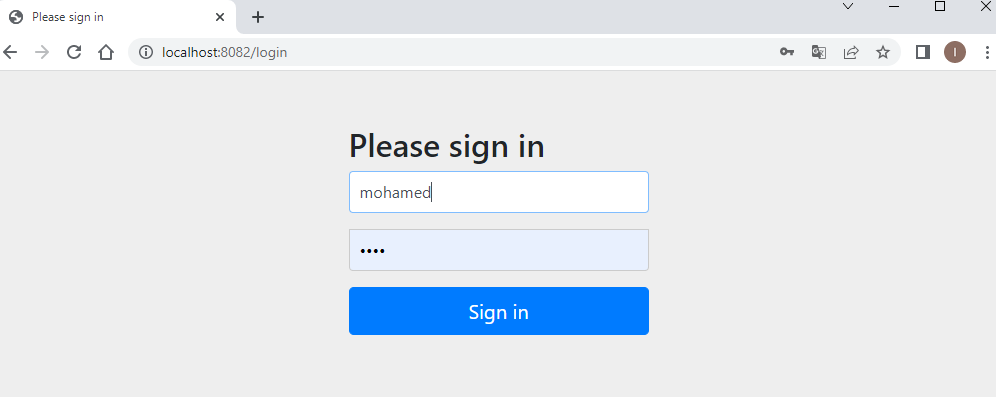
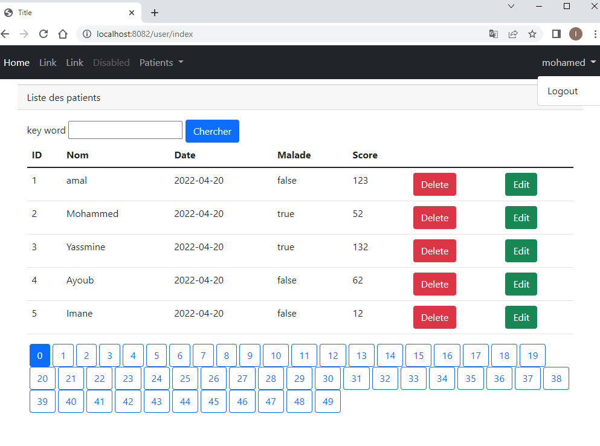

# Gestion_hopital
<h1 style="text-align: center; color: black; font-family: 'Script MT Bold'"> Compte rendu </h1>

 
la création d'une application qui permet de gérer les patients d'un hopital. 
 
<h3>Chaque patient est défini par: </h3>
• Son ID de type Long  
• Son Nom de type String 
• Sa Date de naissance 
• Un attribut qui indique si le patient est malade ou non 
• Un score de type int 

<h3>L’applications permettra aux :</h3>
<h4>utilisateurs de:</h4>
• Consulter les patients 
• Chercher les patients par nom 
<h4>administrateurs de:</h4>
• Ajouter de nouveaux patients 
• Consulter les patients 
• Chercher les patients par nom 
• Mettre à jour un patient 
• Supprimer un patient 

Les données sont stockées dans une base de données MySQL 
La couche web respecte MVC coté serveur. 

<h3><u>Application.proprieties</u></h3> 

<h3><u>la base de donnee pat_db</u></h3> 

<h3>Administrateur</h3>

<h3>Utilisateur</h3>
<img src="image/chercher.png" 
